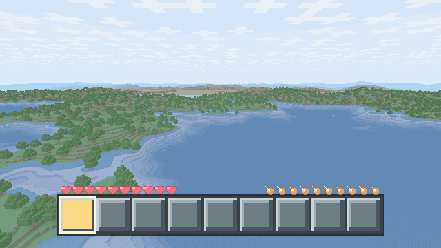
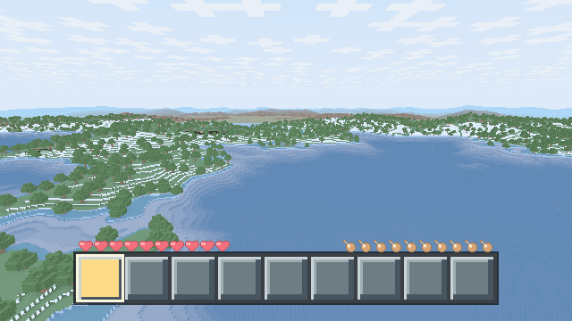
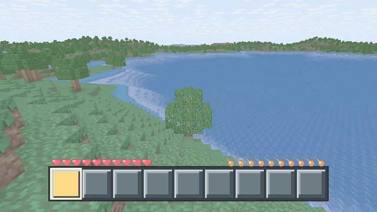
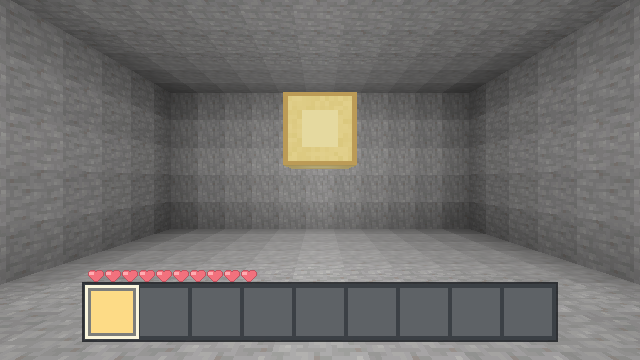
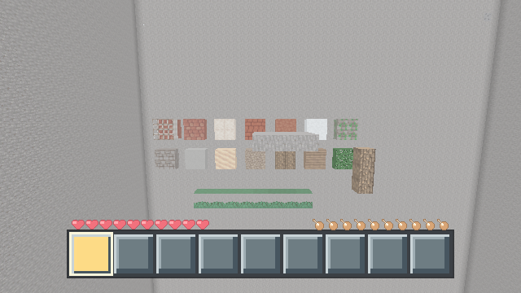

# Mornlea

<p align="center">
  
  
  
  
  
  
  
</p>

> English · [简体中文](README.md)

Mornlea is an original voxel game written from scratch in Go. It ships its own client, an authoritative server, world storage, and a Rust wgpu rendering pipeline. It does **not** aim for compatibility with Minecraft's protocol, saves, or copyrighted assets.

The current baseline uses protocol v29, player schema v7, chunk schema v9, world metadata v2, `companions.ai` schema v4, engine ABI v7, client ABI v9, and benchmark scenario v19. The survival loop covers water, farming (wheat, potatoes, carrots, bone meal), hunger with saturation and exhaustion, oxygen, tool durability, doors, torches, a workbench with server-authoritative 2×2/3×3 crafting grids, sprinting, and up to four named server-authoritative companions that plan queued `go_to`/`follow`/`mine`/`place` tasks and speak through a bounded persona/dialogue path. The local client starts at an egui main menu with a Settings page and an in-game pause overlay (single-player freezes the authoritative tick; remote sessions keep ticking). See [实现进度](docs/notes/progress.md) for the full milestone history.

## Screenshots

<p align="center"></p>

The static screenshots below are taken from the headless visual-verification goldens (640×360, generated by `make visual-check`): noon terrain, oak grove, block-light room, and the materials showcase.

<table>
  <tr>
    <td></td>
    <td></td>
  </tr>
  <tr>
    <td></td>
    <td></td>
  </tr>
</table>

## Requirements

- macOS; the client entry point currently uses Darwin build constraints and is verified primarily on Apple Silicon;
- Go 1.26;
- Rust 1.97.1 installed via rustup;
- A working CGO and C toolchain (macOS: Xcode Command Line Tools);
- Make.

If the command line developer tools are missing:

```bash
xcode-select --install
```

## Quick Start

```bash
git clone https://github.com/channing771/mornlea.git
cd mornlea
make run
```

The first launch generates and loads terrain within the view distance and is noticeably slower than later runs. The default world is stored in `worlds/default`; pass `make run ARGS="--world worlds/demo"` for a separate save directory. `make build` builds the full Rust workspace and produces `bin/mornlea`, `bin/mornlea-server`, and an adjacent `libmornlea_engine.dylib`; no binary may be mixed with dependency libraries from a different build.

## Common Commands

| Command | Description |
| --- | --- |
| `make help` | Show Makefile help (also the default target) |
| `make run` | Run the client; pass CLI arguments via `ARGS` |
| `make build` | Build both Go binaries and the full Rust workspace, copying `bin/libmornlea_engine.dylib` |
| `make build-linux-server` | Build the Linux amd64 `bin/mornlea-server` and an adjacent `bin/libmornlea_engine.so` |
| `make test` | Run all Go tests |
| `make test-race` | Run all Go tests with the race detector |
| `make test-multiplayer` | Run the v6 report, interest-observer, and benchmark scheduling test subset |
| `make bench-multiplayer` | Run the three M3C multiplayer microbenchmarks |
| `make archcheck` | Verify dependency closures and the headless server boundary |
| `make visual-check` | Capture frames headlessly and compare against visual goldens (see [视觉验证](docs/notes/visual-verification.md)) |
| `make dev-check` | gofmt checks and other development gates |
| `make rust` | Build the two pinned Rust 1.97.1 cdylibs; a prerequisite of `run`/`build`/`test` |
| `make rust-check` | Run Rust formatting, clippy, and workspace unit tests |
| `make fmt` | Format the Rust and Go sources in the repository |
| `make clean` | Delete the `bin` directory; world saves are kept |

## Controls at a Glance

| Input | Action |
| --- | --- |
| `W` / `A` / `S` / `D` + Space | Move and jump; hold `Left Ctrl` or `Left Shift` while moving forward to sprint |
| Mouse | Move to look; hold left button to mine/melee, hold right button to use (place, open containers, till, eat, doors, workbench, …) |
| `1` … `9` | Select a hotbar slot |
| `E` | Toggle the inventory (with the personal 2×2 crafting grid) or close the current container |
| `Q` | Drop one item from the selected slot |
| `Enter` | Open chat (also the entry for companion commands `@伙伴名 指令`) |
| `Esc` | Close chat/containers/panels, or open the pause overlay |

The full key table, crafting recipes, farming, containers, mining, survival numbers, and companion behavior are documented in the [玩家手册 (gameplay manual, in Chinese)](docs/notes/gameplay.md).

## Documentation

Most project docs are written in Chinese.

| Topic | Document |
| --- | --- |
| Gameplay manual (keys/crafting/farming/survival/companions) | [docs/notes/gameplay.md](docs/notes/gameplay.md) |
| Configuration file and debug panel | [docs/notes/configuration.md](docs/notes/configuration.md) |
| LAN dedicated server (`mornlea-server`) | [docs/notes/lan-server.md](docs/notes/lan-server.md) |
| Texture packs | [docs/texture-packs.md](docs/texture-packs.md) |
| Current limitations | [docs/notes/limitations.md](docs/notes/limitations.md) |
| Compatibility and upgrades (protocol/saves/backup) | [docs/notes/compatibility.md](docs/notes/compatibility.md) |
| Visual verification | [docs/notes/visual-verification.md](docs/notes/visual-verification.md) |
| Current architecture and repository layout | [docs/architecture.md](docs/architecture.md) |
| Milestone history | [docs/notes/progress.md](docs/notes/progress.md) |
| Full documentation map | [docs/README.md](docs/README.md) |

Minimal LAN session:

```bash
go run ./cmd/mornlea-server --listen :25565 --world worlds/lan --seed 42 --max-players 8
go run ./cmd/mornlea --connect 127.0.0.1:25565 --name PlayerA
```

## Rust / Go Division

The pinned Rust 1.97.1 workspace ships two cdylibs: `mornlea_engine` (the sole production implementation of mesh/light, collision, raycast, physics integration, and worldgen; engine ABI v7) and `mornlea_client` (the Darwin window, event loop, all GPU rendering, and egui screens; client ABI v9). Go owns the app, world, sim, network, storage, and the CPU half of rendering; it never touches GPU APIs and has no production fallback. Each ABI is a release-unit boundary that must not be mixed across builds. See [当前架构说明 (architecture, in Chinese)](docs/architecture.md) for component ownership and dependency direction, and [docs/notes/go-rust-division.md](docs/notes/go-rust-division.md) for the new-code placement rules.

## Developing with OpenSpec

Complex changes — new features, cross-package refactors, protocol, save, or performance contract changes — default to an OpenSpec change (`proposal.md`, delta specs, `design.md`, `tasks.md`) that is validated and archived alongside the implementation; low-risk small fixes can be made directly. Installation, commands, and the automated hook constraints are documented in [docs/openspec.md](docs/openspec.md); project context lives in [`openspec/config.yaml`](openspec/config.yaml) and the AI collaboration rules in [`AGENTS.md`](AGENTS.md).
