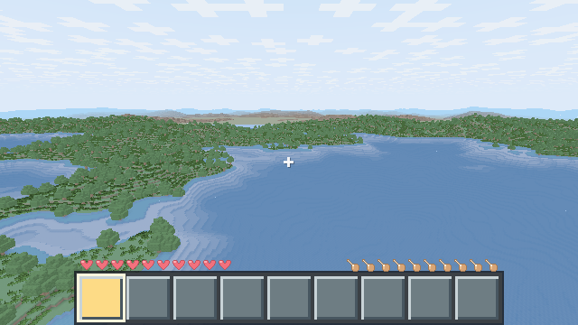
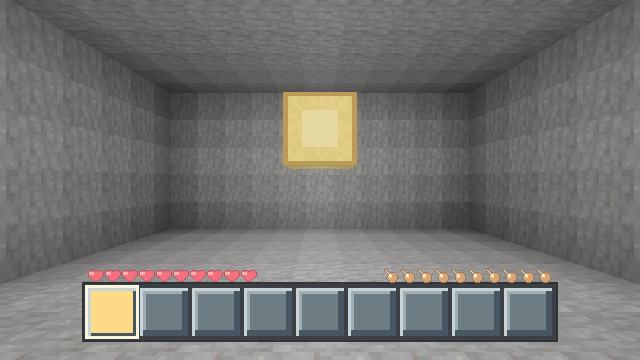
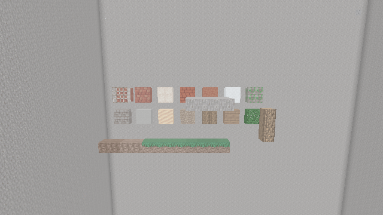

# Mornlea

<p align="center">
  
  
  
  
  
  
  
</p>

> [English](README.en.md) · 简体中文（本文）

`Mornlea` 是一个使用 Go 编写的独立体素游戏实验项目。项目自研客户端、权威服务端、世界存储和 Rust wgpu 渲染管线，不追求兼容官方 Minecraft 的协议、存档或资源。

<details>
<summary>English overview</summary>

Mornlea is an original voxel game written from scratch in Go 1.26 — no Mojang assets, protocol, or saves. It ships a custom client, an authoritative server, persistent worlds, physics, and a Rust wgpu renderer. The current baseline uses protocol v32, player schema v8, chunk schema v9, world metadata v3, `companions.ai` schema v4, `hostile_mobs` schema v1, engine ABI v8, client ABI v13, and benchmark scenario v20. The survival loop covers water, farming (wheat, potatoes, carrots, bone meal), hunger with saturation and exhaustion, oxygen, tiered swords with server-authoritative player and nightwalker melee, tool durability, doors, torches, a workbench with server-authoritative 2×2/3×3 crafting grids, sprinting, beds with night sleeping (all-sleep skips to dawn and sets a personal respawn point), and night-time nightwalkers that chase players, burn in daylight, and persist across restarts; up to four named server-authoritative companions plan queued `go_to`/`follow`/`mine`/`place` tasks and speak through a bounded persona/dialogue path. The local client starts at an in-process WebView (React) main menu with a Settings page and an in-game pause overlay (single-player freezes the authoritative tick; remote sessions keep ticking). The graphical client is macOS-only; the headless Linux dedicated-server bundle uses CGO and an adjacent `libmornlea_engine.so`. MIT licensed.

```bash
git clone https://github.com/channing771/mornlea.git
cd mornlea
make run          # graphical client with a built-in authoritative server
```

Milestone history lives in [实现进度](docs/notes/progress.md); the LAN server guide is [docs/notes/lan-server.md](docs/notes/lan-server.md). Most docs are in Chinese.
</details>

项目仍处于早期开发阶段，已具备程序化地形、GPU 地形渲染、玩家移动与碰撞、客户端预测、方块挖掘与放置、内置权威服务端、世界持久化、有界二进制协议、TCP 直连与无图形专用服务端。已交付里程碑与版本演进见[实现进度](docs/notes/progress.md)。

当前基线使用协议 v32、玩家 schema v8、区块 schema v9、世界 metadata v3、`companions.ai` schema v4、`hostile_mobs` v1、engine ABI v8、client ABI v13 与 benchmark scenario v20。生存循环包含水、农业（小麦/马铃薯/胡萝卜与骨粉催熟）、饥饿/饱和/疲劳、氧气、三级剑与玩家/夜行者统一权威近战、工具耐久、木门、火把、工作台合成、床与睡眠（夜间入睡、全员跳夜与个人重生点）、夜间夜行者（追逐近战、白昼灼烧、跨重启持久）与疾跑；最多四名具名伙伴由服务端权威执行 `go_to`/`follow`/`mine`/`place` 队列任务并经有界台词路径发言。普通本地客户端从进程内 WebView（React）主菜单进入游戏，提供设置页与游戏内暂停覆盖层（单机暂停会冻结权威 tick，远程会话不宣称暂停）。完整玩法细节见[玩家手册](docs/notes/gameplay.md)。

## 截图

<p align="center"></p>

以下静态截图取自无窗口视觉验证基线（640×360，`make visual-check` 生成），从左到右、从上到下依次为：正午地形、橡树林、方块光房间与材料展示。

<table>
  <tr>
    <td></td>
    <td></td>
  </tr>
  <tr>
    <td></td>
    <td></td>
  </tr>
</table>

## 环境要求

- macOS；客户端入口目前使用 Darwin 构建约束，主要在 Apple Silicon 上验证；
- Go 1.26；
- 通过 rustup 安装的 Rust 1.97.1；
- 可用的 CGO 与 C 编译工具链，macOS 可通过 Xcode Command Line Tools 提供；
- Make。

如本机尚未安装命令行开发工具，可执行：

```bash
xcode-select --install
```

## 快速开始

```bash
git clone https://github.com/channing771/mornlea.git
cd mornlea
make run
```

首次启动需要生成并加载视距内的地形，耗时会明显长于后续运行。默认世界保存在 `worlds/default`；使用独立存档目录可加 `make run ARGS="--world worlds/demo"`。`make build` 会构建完整 Rust workspace 并产出 `bin/mornlea`、`bin/mornlea-server` 与相邻的 `libmornlea_engine.dylib`；任一 binary 都不能与其他构建的依赖库混装。

## 常用命令

| 命令 | 说明 |
| --- | --- |
| `make help` | 显示 Makefile 帮助，也是默认目标 |
| `make run` | 运行客户端，可使用 `ARGS` 传递命令行参数 |
| `make build` | 构建两个 Go binary 与完整 Rust workspace，并复制 `bin/libmornlea_engine.dylib` |
| `make build-linux-server` | 构建 Linux amd64 `bin/mornlea-server` 与同目录 `bin/libmornlea_engine.so` |
| `make test` | 运行全部 Go 测试 |
| `make test-race` | 使用 race detector 运行全部 Go 测试 |
| `make test-multiplayer` | 运行 v6 报告、兴趣观察与 benchmark 调度相关测试子集 |
| `make bench-multiplayer` | 运行三组 M3C 多人微基准 |
| `make archcheck` | 验证依赖闭包与无图形服务端边界 |
| `make visual-check` | 无头抓帧并与视觉 golden 基线比对（见[视觉验证](docs/notes/visual-verification.md)） |
| `make dev-check` | gofmt 检查等开发门禁 |
| `make rust` | 构建固定 Rust 1.97.1 workspace 的两个 cdylib，`run`/`build`/`test` 等目标的前置依赖 |
| `make rust-check` | 运行 Rust 格式、clippy 与 workspace 单测 |
| `make fmt` | 格式化仓库内的 Rust 与 Go 源码 |
| `make clean` | 删除 `bin` 目录，不会删除世界存档 |

## 操作一览

| 输入 | 操作 |
| --- | --- |
| `W` / `A` / `S` / `D` + 空格 | 移动与跳跃；按住 `Left Ctrl` 或 `Left Shift` 前移可疾跑 |
| 鼠标 | 移动转动视角；按住左键采掘/近战，按住右键使用（放置、开箱开炉、翻地、进食、开门、工作台等） |
| `1` … `9` | 选择快捷栏栏位 |
| `E` | 打开/关闭背包（含个人 2×2 合成网格）或关闭当前容器 |
| `Q` | 丢弃选中栏位的一件物品 |
| `Enter` | 打开聊天（也是伙伴指令 `@伙伴名 指令` 的入口） |
| `Esc` | 关闭聊天/容器/面板，或打开暂停覆盖层 |

完整键位、合成配方、农业、容器、采掘、生存数值与伙伴行为见[玩家手册](docs/notes/gameplay.md)。

## 文档导航

| 主题 | 文档 |
| --- | --- |
| 玩法手册（键位/合成/农业/生存/伙伴） | [docs/notes/gameplay.md](docs/notes/gameplay.md) |
| 配置文件与调试面板 | [docs/notes/configuration.md](docs/notes/configuration.md) |
| 局域网专用服务端（`mornlea-server`） | [docs/notes/lan-server.md](docs/notes/lan-server.md) |
| 材质包 | [docs/texture-packs.md](docs/texture-packs.md) |
| 当前限制 | [docs/notes/limitations.md](docs/notes/limitations.md) |
| 兼容性与升级（协议/存档/备份回退） | [docs/notes/compatibility.md](docs/notes/compatibility.md) |
| 视觉验证 | [docs/notes/visual-verification.md](docs/notes/visual-verification.md) |
| 当前架构与仓库目录 | [docs/architecture.md](docs/architecture.md) |
| 实现进度与里程碑 | [docs/notes/progress.md](docs/notes/progress.md) |
| 文档总地图 | [docs/README.md](docs/README.md) |

局域网联机最简启动：

```bash
go run ./cmd/mornlea-server --listen :25565 --world worlds/lan --seed 42 --max-players 8
go run ./cmd/mornlea --connect 127.0.0.1:25565 --name 玩家甲
```

## Rust 与 Go 的职责划分

固定 Rust 1.97.1 workspace 包含 `mornlea_engine`（mesh/light、collision、raycast、physics 积分与 worldgen 的唯一生产实现，engine ABI v8）与 `mornlea_client`（Darwin 窗口、事件循环、全部 GPU 渲染与 WebView 菜单层，client ABI v13）两个 cdylib。Go 拥有 app、world、sim、network、storage 与渲染 CPU 半部，不接触 GPU API，也没有生产 fallback；两条 ABI 各自是不可跨版本混装的 release-unit 边界。组件所有权与依赖方向见[当前架构说明](docs/architecture.md)，新代码归属规矩见 [docs/notes/go-rust-division.md](docs/notes/go-rust-division.md)。

## 使用 OpenSpec 开发

本项目使用 OpenSpec 管理复杂变更：新功能、跨包重构、协议、存档或性能契约变化默认先写 change 产物（`proposal.md`、delta specs、`design.md`、`tasks.md`），实现完成后校验并归档；低风险小改动可直接完成。安装、命令与自动 Hook 约束见 [docs/openspec.md](docs/openspec.md)，项目上下文见 [`openspec/config.yaml`](openspec/config.yaml)，AI 协作规则见 [`AGENTS.md`](AGENTS.md)。
